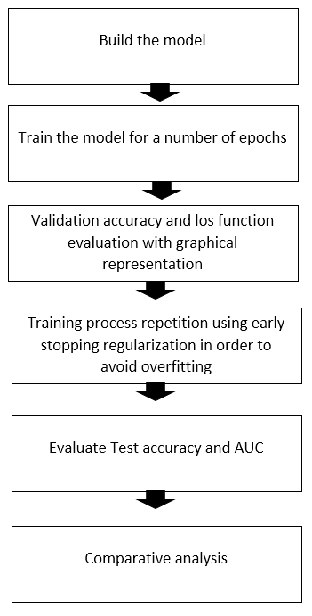

## DATA DESCRIPTION 
### 1. Samples
.jpg 10.239 mammographic images

.csv 6 files

### 2. Properties
The dataset contains:

753 calcification cases

891 mass cases

Density category

Breast: Left or Right

View: CC (craniocaudal) or MLO (mediolateral oblique)

The DDSM is a database of 2,620 scanned film mammography studies

### 3. Classes
It contains: normal, benign, and malignant cases with verified pathology information.

Pathology: Benign, Benign without call-back, or Malignant

## LITERATURE REVIEW
### Methods
1. Image processing

Clip optical density values to be between 0.05 and 3.0 for noise reduction.

2. Image cropping

Abnormalities were cropped by determining the bounding rectangle of the abnormality with respect to its ROI.

3. Standardized train/test splits

The data were split into a training set and a testing set based on the BI-RADS (Breast imaging reporting and data system) category

20% of the cases for testing

80% of the cases for training

### Performance evaluation

2 metrics: Accuracy & AUC (area under ROC curve)

### Architecture
The texture analysis has been done on the region of interest (ROI) selected from the original mammogram

Using Support Vector Machine (SVM) classifier.

Pre-train: ImageNet/ InceptionV3 / ResNet-50

Model: DNN/new VGG16

